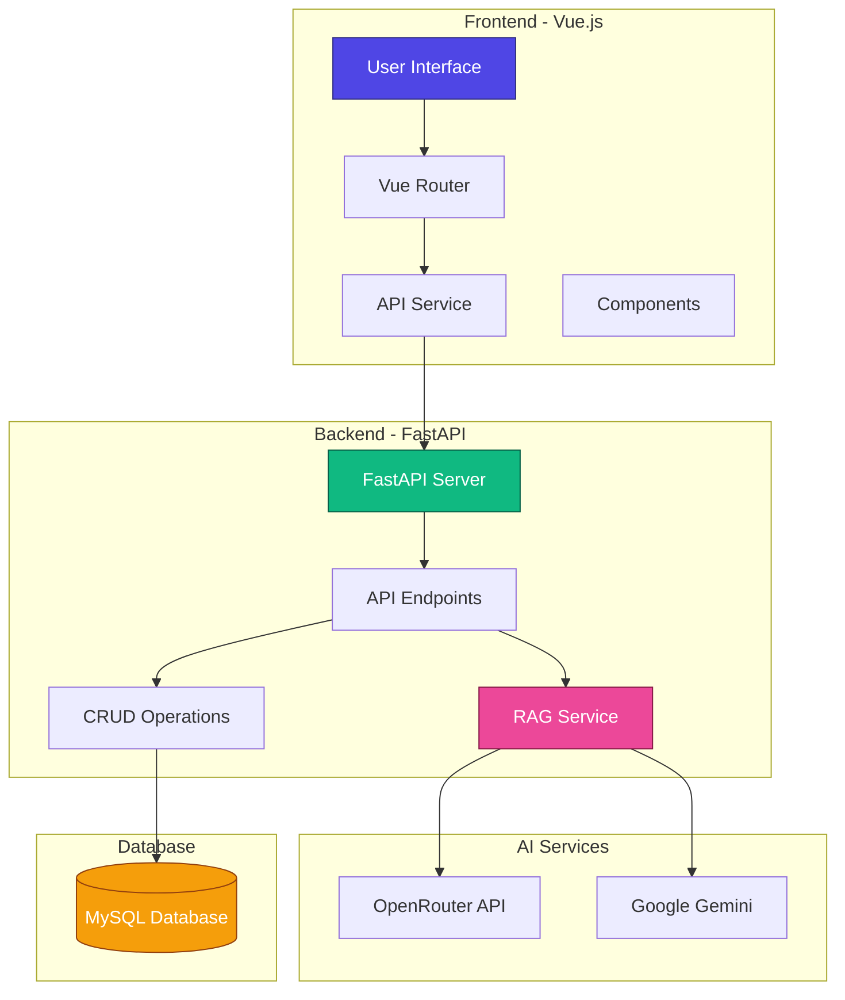
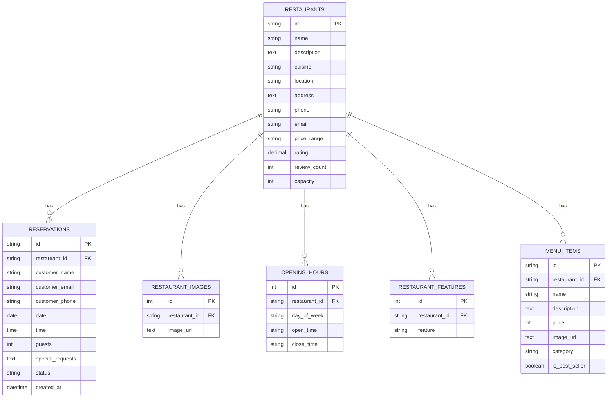
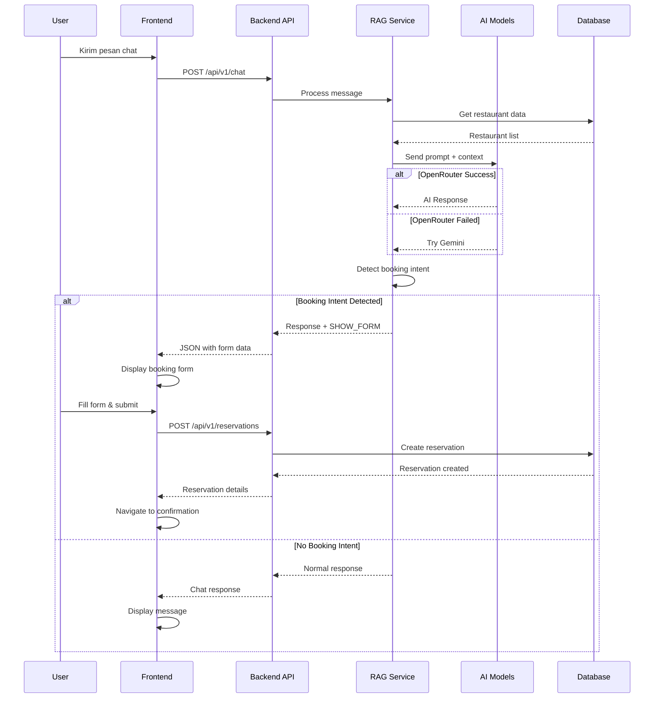
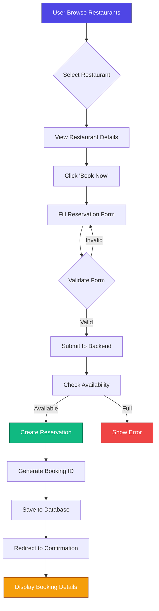
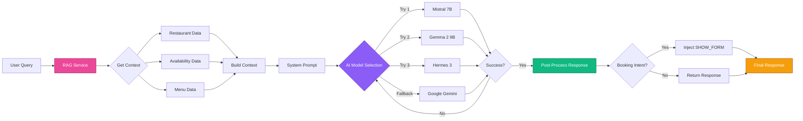
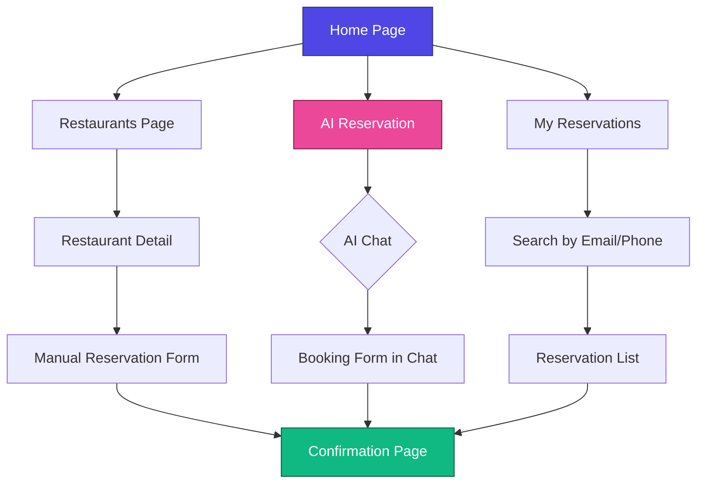

# 🍽️ RAG Resto - AI-Powered Restaurant Reservation System

Sistem reservasi restoran berbasis AI yang menggunakan teknologi RAG (Retrieval-Augmented Generation) untuk memberikan rekomendasi restoran yang personal dan akurat. Proyek ini menggabungkan backend FastAPI dengan frontend Vue.js untuk menciptakan pengalaman booking yang seamless.

## 📋 Daftar Isi

- [Arsitektur Sistem](#-arsitektur-sistem)
- [Teknologi](#-teknologi)
- [Fitur Utama](#-fitur-utama)
- [Struktur Project](#-struktur-project)
- [Instalasi](#-instalasi)
- [Konfigurasi](#-konfigurasi)
- [Menjalankan Aplikasi](#-menjalankan-aplikasi)
- [API Endpoints](#-api-endpoints)
- [Database Schema](#-database-schema)
- [Flow Diagram](#-flow-diagram)

## 🏗️ Arsitektur Sistem



## 🛠️ Teknologi

### Backend
- **FastAPI** - Modern Python web framework
- **SQLAlchemy** - ORM untuk database
- **MySQL** - Database relational
- **Pydantic** - Data validation
- **OpenRouter API** - Multi-model AI gateway
- **Google Gemini** - AI model fallback
- **Python-dotenv** - Environment management

### Frontend
- **Vue 3** - Progressive JavaScript framework
- **TypeScript** - Type-safe JavaScript
- **Vue Router** - Routing management
- **Axios** - HTTP client
- **Tailwind CSS** - Utility-first CSS framework
- **Heroicons** - Beautiful icons
- **Vite** - Fast build tool

## ✨ Fitur Utama

### 🤖 AI-Powered Chat Assistant
- Asisten AI yang membantu user menemukan restoran
- Rekomendasi berdasarkan preferensi (cuisine, lokasi, rating, harga)
- Multi-model fallback (OpenRouter + Google Gemini)
- Natural language processing untuk booking intent detection

### 📝 Smart Reservation System
- Booking langsung melalui chat interface
- Form reservasi otomatis muncul saat AI mendeteksi booking intent
- Validasi ketersediaan real-time
- Konfirmasi booking dengan detail lengkap

### 🍜 Restaurant Management
- Database restoran lengkap dengan menu, rating, dan foto
- Filter berdasarkan cuisine, lokasi, dan harga
- Detail restoran dengan jam operasional dan fasilitas
- Sistem kapasitas dan availability tracking

### 👤 User Features
- Pencarian reservasi berdasarkan email/phone
- Riwayat reservasi
- Halaman konfirmasi booking
- Responsive design untuk semua device

## 📁 Struktur Project

```
uas-genAI/
├── backend/
│   └── restaurant-service/
│       ├── app/
│       │   ├── api/
│       │   │   └── v1/
│       │   │       └── endpoints/
│       │   │           ├── chat.py          # AI chat endpoint
│       │   │           ├── reservations.py  # Reservation CRUD
│       │   │           └── restaurants.py   # Restaurant CRUD
│       │   ├── core/
│       │   │   └── config.py               # Configuration
│       │   ├── crud/
│       │   │   ├── reservation.py          # Reservation operations
│       │   │   └── restaurant.py           # Restaurant operations
│       │   ├── db/
│       │   │   └── session.py              # Database session
│       │   ├── models/
│       │   │   ├── reservation.py          # Reservation model
│       │   │   └── restaurant.py           # Restaurant models
│       │   ├── schemas/
│       │   │   ├── reservation.py          # Reservation schemas
│       │   │   └── restaurant.py           # Restaurant schemas
│       │   ├── services/
│       │   │   └── rag_service.py          # RAG AI service
│       │   └── main.py                     # FastAPI app
│       ├── requirements.txt
│       └── .env
├── rag-resto-vue/
│   ├── src/
│   │   ├── components/
│   │   │   ├── HeroSection.vue
│   │   │   ├── RestaurantCard.vue
│   │   │   ├── RestaurantGrid.vue
│   │   │   ├── TheFooter.vue
│   │   │   └── TheNavbar.vue
│   │   ├── views/
│   │   │   ├── AIReservationPage.vue       # AI chat interface
│   │   │   ├── ConfirmationPage.vue        # Booking confirmation
│   │   │   ├── HomePage.vue                # Landing page
│   │   │   ├── ReservationPage.vue         # Manual reservation
│   │   │   ├── RestaurantDetailPage.vue    # Restaurant details
│   │   │   ├── RestaurantsPage.vue         # Restaurant list
│   │   │   └── UserReservationsPage.vue    # User's reservations
│   │   ├── services/
│   │   │   └── api.ts                      # API client
│   │   ├── router/
│   │   │   └── index.ts                    # Route configuration
│   │   ├── App.vue
│   │   └── main.ts
│   ├── package.json
│   └── tailwind.config.js
└── data/                                    # SQL seed files
```

## 🚀 Instalasi

### Prerequisites
- Python 3.9+
- Node.js 18+
- MySQL 8.0+

### Backend Setup

```bash
# Navigate to backend directory
cd backend/restaurant-service

# Create virtual environment
python -m venv venv

# Activate virtual environment
# On macOS/Linux:
source venv/bin/activate
# On Windows:
# venv\Scripts\activate

# Install dependencies
pip install -r requirements.txt
```

### Frontend Setup

```bash
# Navigate to frontend directory
cd rag-resto-vue

# Install dependencies
npm install
```

### Database Setup

```bash
# Create MySQL database
mysql -u root -p

CREATE DATABASE reservasi_restor;
USE reservasi_restor;

# Import seed data (if available)
SOURCE ../data/seed_restaurants.sql;
SOURCE ../data/create_reservations.sql;
```

## ⚙️ Konfigurasi

### Backend Configuration

Create `.env` file in `backend/restaurant-service/`:

```env
# Database Configuration
MYSQL_USER=root
MYSQL_PASSWORD=your_password
MYSQL_SERVER=localhost
MYSQL_PORT=3306
MYSQL_DB=reservasi_restor

# AI API Keys
OPENROUTER_API_KEY=your_openrouter_api_key
GOOGLE_API_KEY=your_google_api_key
```

### Frontend Configuration

Update API base URL in `rag-resto-vue/src/services/api.ts` if needed:

```typescript
const API_BASE_URL = 'http://localhost:8000/api/v1';
```

## 🎯 Menjalankan Aplikasi

### Start Backend

```bash
cd backend/restaurant-service
source venv/bin/activate  # On Windows: venv\Scripts\activate
uvicorn app.main:app --reload --port 8000
```

Backend akan berjalan di: `http://localhost:8000`

API Documentation: `http://localhost:8000/docs`

### Start Frontend

```bash
cd rag-resto-vue
npm run dev
```

Frontend akan berjalan di: `http://localhost:5173`

## 📡 API Endpoints

### Restaurants

| Method | Endpoint | Description |
|--------|----------|-------------|
| GET | `/api/v1/restaurants` | Get all restaurants |
| GET | `/api/v1/restaurants/{id}` | Get restaurant by ID |

### Reservations

| Method | Endpoint | Description |
|--------|----------|-------------|
| GET | `/api/v1/reservations` | Get all reservations (with filters) |
| GET | `/api/v1/reservations/{id}` | Get reservation by ID |
| POST | `/api/v1/reservations` | Create new reservation |
| PUT | `/api/v1/reservations/{id}` | Update reservation |
| DELETE | `/api/v1/reservations/{id}` | Cancel reservation |

### AI Chat

| Method | Endpoint | Description |
|--------|----------|-------------|
| POST | `/api/v1/chat` | Chat with AI assistant |

**Request Body:**
```json
{
  "message": "Saya mencari restoran Padang"
}
```

**Response:**
```json
{
  "response": "Saya merekomendasikan Warung Tekko..."
}
```

## 🗄️ Database Schema



## 🔄 Flow Diagram

### 1. AI Chat & Reservation Flow



### 2. Manual Reservation Flow



### 3. RAG Service Architecture



### 4. Frontend Navigation Flow



## 🎨 Key Features Explained

### RAG (Retrieval-Augmented Generation)

RAG Service menggabungkan data restoran dari database dengan AI language model untuk memberikan rekomendasi yang akurat:

1. **Retrieval**: Mengambil data restoran, menu, dan availability dari database
2. **Augmentation**: Menambahkan context ke prompt AI
3. **Generation**: AI menghasilkan response berdasarkan data real

### Multi-Model Fallback Strategy

Sistem menggunakan multiple AI models dengan fallback mechanism:

1. **Primary**: OpenRouter dengan 12+ free models
2. **Fallback**: Google Gemini 2.5 Flash
3. **Auto-retry**: Otomatis mencoba model lain jika gagal

### Smart Booking Intent Detection

Backend mendeteksi booking intent dengan 2 cara:

1. **AI Detection**: Model AI mendeteksi dan return `SHOW_FORM:`
2. **Post-Processing**: Backend inject `SHOW_FORM:` jika AI gagal detect

Keywords: `booking`, `book`, `pesan`, `reservasi`, `ya`, `iya`, `tentu`, `ok`

## 🔐 Security Notes

- CORS enabled untuk development (perlu dikonfigurasi untuk production)
- API keys disimpan di environment variables
- Input validation menggunakan Pydantic schemas
- SQL injection protection via SQLAlchemy ORM

## 📝 Development Notes

### Backend
- FastAPI auto-generates OpenAPI documentation di `/docs`
- Database tables dibuat otomatis via SQLAlchemy
- Async support untuk better performance

### Frontend
- TypeScript untuk type safety
- Tailwind CSS untuk rapid UI development
- Component-based architecture
- Responsive design

## 🤝 Contributing

1. Fork repository
2. Create feature branch (`git checkout -b feature/AmazingFeature`)
3. Commit changes (`git commit -m 'Add some AmazingFeature'`)
4. Push to branch (`git push origin feature/AmazingFeature`)
5. Open Pull Request

## 📄 License

This project is created for educational purposes (UAS GenAI).

## 👨‍💻 Author

**Raihan Setiawan**

---

**Note**: Pastikan semua API keys sudah dikonfigurasi dengan benar sebelum menjalankan aplikasi. Untuk production deployment, tambahkan proper security measures dan environment-specific configurations.
